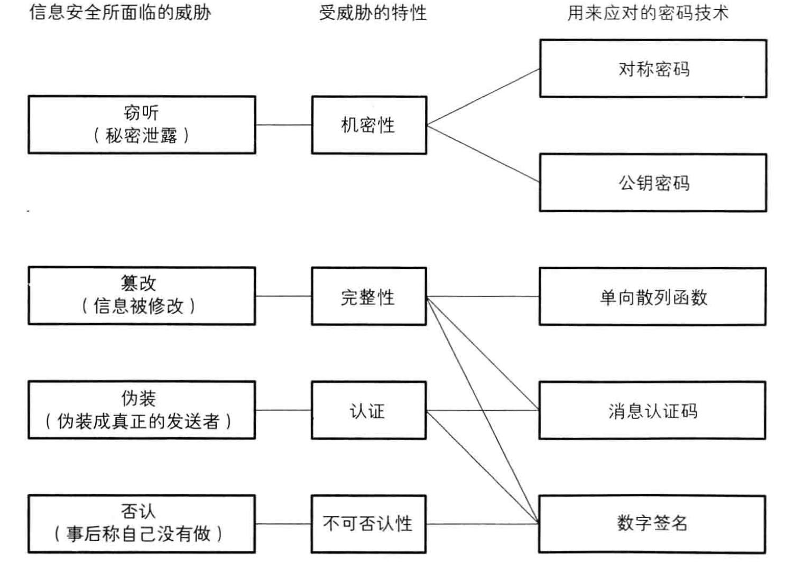

# 图解密码技术

## 第一章 环游密码世界

### 1.2 密码

**发送者**：发送消息的人。

**接收者**：收到消息的人。

**消息**（message）：被发送的消息。

**窃听者**：消息在发送途中偷看消息的人。可能是安装在通信设备上的某种窃听器，也可能是安装在邮件软件和邮件服务器上的某些程序。

**明文**：加密之前的消息。

**密文**：加密之后的消息。

**解密**：将明文恢复为密文的过程。

**密码破译/破译/密码分析**：接收者之外的其他人试图将密文还原为明文。进行破译的人成为**破译者**。

### 1.3 对称密码与公钥密码

#### 1.3.1 密码算法

加密步骤称为”加密算法“，解密步骤称为”解密算法“。加密、解密的算法合称**密码算法**。

#### 1.3.2 密钥

密码算法中需要密钥，加密和解密都需要知道密钥。不要让密码的密钥被他人窃取。

#### 1.3.3 对称密码与公钥密码

**对称密码**是指加密和解密时使用同一密钥的方式，又称**公共密钥密码**、**传统密码**、**私钥密码**、**共享密钥密码**等。

**公钥密码**是指加密和解密时使用不同密钥的方式，又称**非对称密码**。

#### 1.3.4 混合密码系统

将对称密码和公钥密码结合起来的密码方式称为**混合密码系统**，这种系统结合了对称密码和公钥密码两者的优势。

### 1.4 其他密码技术

#### 1.4.1 单向散列函数

单向散列函数是一项保证**完整性**的密码技术。完整性指的是”数据是正牌的而不是伪造的。

**散列值**就是用单向散列函数计算出来的数值，又称**哈希值**、**密码校验**、**指纹**、**消息摘要**。

#### 1.4.2 消息认证码

消息认证码是一项保证完整性和提供认证的密码技术。通过使用消息认证码，不但能够确认消息是否被篡改，而且能够确认消息是否来自所期待的通信对象。

#### 1.4.3 数字签名

数字签名是一项能够确保完整性、提供认证并防止否认的密码技术。

#### 1.4.4 伪随机数生成器

伪随机数是一种能够模拟产生随机数的算法，随机数承担着密钥生成的重要职责。

### 1.5 密码学家的工具箱

### 1.6 隐写术与数字水印

**隐写术**能够隐藏消息本身，但是如果知道消息嵌入的方式，也可以知道消息的内容。

**数字水印**是一种将著作权拥有者及购买者的信息嵌入文件中的技术，运用了隐写术的方法。

### 1.7 密码与信息安全常识

#### 1.7.1 不要使用保密的密码算法

试图通过对密码算法本身进行保密来确保安全性的行为称为**隐蔽式安全性**，这种行为是危险且愚蠢的。

#### 1.7.2 使用低强度的密码比不进行任何加密更危险

用户容易通过“密码"这个词获得一种”错误的安全感“，从而导致在处理一些机密信息时麻痹大意。

#### 1.7.3 任何密码都有被破解的一天

#### 1.7.4 密码只是信息安全的一部分

信息安全系统的强度取决于其中最脆弱的环节的强度，最脆弱的环节不是密码，而是人类自己。

## 第二章 历史上的密码

### 2.2 凯撒密码

#### 2.2.1 什么是凯撒密码

凯撒密码是通过将明文中所使用的字母表按照一定的字数“平移”来进行加密的密码。

#### 2.2.2 凯撒密码的加密

凯撒密码中将字母表中的字母平移的这个操作就是密码的算法，平移的字母数量相当于密钥。

#### 2.2.3 凯撒密码的解密

凯撒密码的解密过程是使用与加密时相同的密钥进行反向的平移操作。

#### 2.2.4 用暴力破解来破译密码

在凯撒密码中，密钥就是字母表平移的字数。由于字母表只有26个字母，因此加密用的密钥只有0到25共26种。

将所有可能的密钥全部尝试一边的密码破译方法称为**暴力破解**。由于这种方法本质是从所有的密钥中找到正确的密钥，因此又称为**穷举搜索**。

### 2.3 简单替换密码

#### 2.3.1 什么是简单替换密码

将明文所使用的字母表替换为另一套字母表的密码称为**简单替换密码**。凯撒密码是简单替换密码的一种。

#### 2.3.2 简单替换密码的加密

简单替换密码的加密过程是依次将明文中的每一个字母按照替换表替换成另一个字母。

#### 2.3.3 简单替换密码的解密

只要使用加密时所使用的替换表进行反向替换就可对简单替换密码进行解密。替换表相当于简单替换密码的密钥。

#### 2.3.4 简单替换密码的密钥空间

一种密码能够使用的“所有密钥的集合”称为**密钥空间**。密钥空间越大，暴力破解就越困难。

简单替换密码中，明文字母表a可以对应A、B、C、······、Z这26个子母中的任意一个，b可以对应除了a所对应的字母以外的剩余25个字母中的任意一个。以此类推，简单替换密码的密钥空间总数为26！个。

#### 2.3.5 用频率分析来破译密码

频率分析利用了明文中的*字母的出现频率与密文中的字母出现频率一致*这一特性。

频率分析步骤：

1. 统计密文中每个字母出现的频率。
2. 尝试将高频字母与英文中高频使用的字母对应。
3. 仔细观察，结合密文逐步推导寻找可能的组合。

### 2.4 Enigma

#### 2.4.1 什么是Enigma

Enigma是由德国人阿瑟·谢尔比乌斯于20世纪发明的一种能够进行加密和解密操作的机器。该机器使用转动的圆盘和电路，可以创造出人类手工所无法实现的高强度密码。

#### 2.4.2 用Enigma进行加密通信

发送者和接收者各自拥有一台Enigma。发送者用Enigma将明文加密，将生成的密文通过无线电发送给接收者。接收者将接收到的密文用自己的Enigma解密，从而得到明文。发送者和接收者必须使用相同的密钥才能完成加密通信。

#### 2.4.3 Enigma的构造

略

#### 2.4.4 Enigma的加密

1. 设置Enigma：发送者查阅国防军密码本，找到当天的每日密码，并按照改密码来设置Enigma。
2. 加密通信密码：发送者选定三个字母作为通信密码，使用Enigma输入两次该通信密码进行加密。
3. 重新设置Enigma：发送者根据通信密码重新设置Enigma。通信密码中的3个字母实际上代表三个转子的初始位置。
4. 加密消息
5. 拼接 发送者将加密后的通信密码与加密后的消息进行拼接，再通过无线电发送出去。

#### 2.4.6 每日密码与通信密码

每日密码用来加密通信密码，通信密码用来加密消息。故每日密码其实是一种用来加密密钥的密钥，一般称为**密钥加密密钥**。

采用两重加密是因为用同一个密钥所加密的密文越多，破译的线索也会越多，被破译的危险性也会增加。

#### 2.4.6 避免通信错误

在通信密码的加密中，需要将通信密码连续输入两次是为了避免因无线电质量差而发生通信错误。

#### 2.4.7 Enigma的解密

