# 图解密码技术

## 第一章 环游密码世界

### 1.2 密码

**发送者**：发送消息的人。

**接收者**：收到消息的人。

**消息**（message）：被发送的消息。

**窃听者**：消息在发送途中偷看消息的人。可能是安装在通信设备上的某种窃听器，也可能是安装在邮件软件和邮件服务器上的某些程序。

**明文**：加密之前的消息。

**密文**：加密之后的消息。

**解密**：将明文恢复为密文的过程。

**密码破译/破译/密码分析**：接收者之外的其他人试图将密文还原为明文。进行破译的人成为**破译者**。

### 1.3 对称密码与公钥密码

#### 1.3.1 密码算法

加密步骤称为”加密算法“，解密步骤称为”解密算法“。加密、解密的算法合称**密码算法**。

#### 1.3.2 密钥

密码算法中需要密钥，加密和解密都需要知道密钥。不要让密码的密钥被他人窃取。

#### 1.3.3 对称密码与公钥密码

**对称密码**是指加密和解密时使用同一密钥的方式，又称**公共密钥密码**、**传统密码**、**私钥密码**、**共享密钥密码**等。

**公钥密码**是指加密和解密时使用不同密钥的方式，又称**非对称密码**。

#### 1.3.4 混合密码系统

将对称密码和公钥密码结合起来的密码方式称为**混合密码系统**，这种系统结合了对称密码和公钥密码两者的优势。

### 1.4 其他密码技术

#### 1.4.1 单向散列函数

单向散列函数是一项保证**完整性**的密码技术。完整性指的是”数据是正牌的而不是伪造的。

**散列值**就是用单向散列函数计算出来的数值，又称**哈希值**、**密码校验**、**指纹**、**消息摘要**。

#### 1.4.2 消息认证码

消息认证码是一项保证完整性和提供认证的密码技术。通过使用消息认证码，不但能够确认消息是否被篡改，而且能够确认消息是否来自所期待的通信对象。

#### 1.4.3 数字签名

数字签名是一项能够确保完整性、提供认证并防止否认的密码技术。

#### 1.4.4 伪随机数生成器

伪随机数是一种能够模拟产生随机数的算法，随机数承担着密钥生成的重要职责。

### 1.5 密码学家的工具箱

### 1.6 隐写术与数字水印

**隐写术**能够隐藏消息本身，但是如果知道消息嵌入的方式，也可以知道消息的内容。

**数字水印**是一种将著作权拥有者及购买者的信息嵌入文件中的技术，运用了隐写术的方法。

### 1.7 密码与信息安全常识

#### 1.7.1 不要使用保密的密码算法

试图通过对密码算法本身进行保密来确保安全性的行为称为**隐蔽式安全性**，这种行为是危险且愚蠢的。

#### 1.7.2 使用低强度的密码比不进行任何加密更危险

用户容易通过“密码"这个词获得一种”错误的安全感“，从而导致在处理一些机密信息时麻痹大意。

#### 1.7.3 任何密码都有被破解的一天

#### 1.7.4 密码只是信息安全的一部分

信息安全系统的强度取决于其中最脆弱的环节的强度，最脆弱的环节不是密码，而是人类自己。

## 第二章 历史上的密码

### 2.2 凯撒密码

#### 2.2.1 什么是凯撒密码

凯撒密码是通过将明文中所使用的字母表按照一定的字数“平移”来进行加密的密码。

#### 2.2.2 凯撒密码的加密

凯撒密码中将字母表中的字母平移的这个操作就是密码的算法，平移的字母数量相当于密钥。

#### 2.2.3 凯撒密码的解密

凯撒密码的解密过程是使用与加密时相同的密钥进行反向的平移操作。

#### 2.2.4 用暴力破解来破译密码

在凯撒密码中，密钥就是字母表平移的字数。由于字母表只有26个字母，因此加密用的密钥只有0到25共26种。

将所有可能的密钥全部尝试一边的密码破译方法称为**暴力破解**。由于这种方法本质是从所有的密钥中找到正确的密钥，因此又称为**穷举搜索**。

### 2.3 简单替换密码

#### 2.3.1 什么是简单替换密码

将明文所使用的字母表替换为另一套字母表的密码称为**简单替换密码**。凯撒密码是简单替换密码的一种。

#### 2.3.2 简单替换密码的加密

简单替换密码的加密过程是依次将明文中的每一个字母按照替换表替换成另一个字母。

#### 2.3.3 简单替换密码的解密

只要使用加密时所使用的替换表进行反向替换就可对简单替换密码进行解密。替换表相当于简单替换密码的密钥。

#### 2.3.4 简单替换密码的密钥空间

一种密码能够使用的“所有密钥的集合”称为**密钥空间**。密钥空间越大，暴力破解就越困难。

简单替换密码中，明文字母表a可以对应A、B、C、······、Z这26个子母中的任意一个，b可以对应除了a所对应的字母以外的剩余25个字母中的任意一个。以此类推，简单替换密码的密钥空间总数为26！个。

#### 2.3.5 用频率分析来破译密码

频率分析利用了明文中的*字母的出现频率与密文中的字母出现频率一致*这一特性。

频率分析步骤：

1. 统计密文中每个字母出现的频率。
2. 尝试将高频字母与英文中高频使用的字母对应。
3. 仔细观察，结合密文逐步推导寻找可能的组合。

### 2.4 Enigma

#### 2.4.1 什么是Enigma

Enigma是由德国人阿瑟·谢尔比乌斯于20世纪发明的一种能够进行加密和解密操作的机器。该机器使用转动的圆盘和电路，可以创造出人类手工所无法实现的高强度密码。

#### 2.4.2 用Enigma进行加密通信

发送者和接收者各自拥有一台Enigma。发送者用Enigma将明文加密，将生成的密文通过无线电发送给接收者。接收者将接收到的密文用自己的Enigma解密，从而得到明文。发送者和接收者必须使用相同的密钥才能完成加密通信。

#### 2.4.3 Enigma的构造

略

#### 2.4.4 Enigma的加密

1. 设置Enigma：发送者查阅国防军密码本，找到当天的每日密码，并按照改密码来设置Enigma。
2. 加密通信密码：发送者选定三个字母作为通信密码，使用Enigma输入两次该通信密码进行加密。
3. 重新设置Enigma：发送者根据通信密码重新设置Enigma。通信密码中的3个字母实际上代表三个转子的初始位置。
4. 加密消息
5. 拼接 发送者将加密后的通信密码与加密后的消息进行拼接，再通过无线电发送出去。

#### 2.4.6 每日密码与通信密码

每日密码用来加密通信密码，通信密码用来加密消息。故每日密码其实是一种用来加密密钥的密钥，一般称为**密钥加密密钥**。

采用两重加密是因为用同一个密钥所加密的密文越多，破译的线索也会越多，被破译的危险性也会增加。

#### 2.4.6 避免通信错误

在通信密码的加密中，需要将通信密码连续输入两次是为了避免因无线电质量差而发生通信错误。

#### 2.4.7 Enigma的解密

1. 分解：接收者将接收到的电文分解成两个部分，及开头的6个字母和剩下的字母。
2. 设置Enigma：接收者查阅国防军密码本中的每日密码，并按照该密码设置Enigma。
3. 解密通信密码
4. 重新设置Enigma：根据通信密码重新设置Enigma。
5. 解密消息

#### 2.4.8 Enigma的弱点

1. 将通信密码连续两次输入进行加密。
2. 通信密码是人为选定。
3. 必须派发国防军密码本。

**Enigma的密钥**：

*通信密码的加密*中密钥是接线板的接线方式、三个转子的顺序、每个转子的旋转位置。

*通信电文的加密*中密钥是每个转子的旋转位置。

## 第三章 对称密码（共享密钥密码）

### 3.3 从文字密码到比特序列密码

#### 3.3.1 编码

将现实世界中的东西映射为比特序列的操作称为**编码**。

#### 3.3.2 XOR（异或）

两个相同的数进行异或运算的结果一定是0。因此，A异或B异或A=B。

**比特序列的异或**：逐位异或，不需进位。

对同一个比特序列进行两次异或之后就会回到最初的状态。

### 3.4 一次性密码本——绝对不会被破译的密码

#### 3.4.2 一次性密码本的加密

将明文通过ASCII进行编码后与一串随机的比特序列进行异或运算。

#### 3.4.3 一次性密码本的解密

将密文与密钥进行异或运算即得到明文。

#### 3.4.4 一次性密码本是无法破译的

暴力破解是按顺序将所有的密钥都尝试一遍，并判断所得到的是不是正确的明文的方法。但是，在一次性密码本中，由于**无法判断得到的是不是正确的明文**，因此一次性密码本是无法破译的，是无条件安全的，在理论上无法破译。

#### 3.4.5 一次性密码本为什么没有被使用

一次性密码本的密钥的生成、配送、保存都十分困难。且不能重用过去使用过的密钥，同时必须确保发送者和接收者的密钥的比特序列完全同步，不能有任何错位。

### 3.5 DES

#### 3.5.1 什么是DES

DES是一种将64比特的明文加密成64比特的密文的对称密码。从规格上看，DES的密钥长度是64比特，但由于每隔7比特会设置一个用于错误检验的比特，因此实质上其密钥长度是56比特。

#### 3.5.2 加密与解密

DES是以64比特的明文为一个单位来进行加密的，这个64比特的单位称为**分组**。一般来说，以分组为单位进行处理的密码算法称为**分组密码**。DES是分组密码的一种。

DES每次只能加密64比特的数据，如果要加密的明文比较长，就需要对DES加密进行迭代，而迭代的具体方式称为**模式**。

#### 3.5.3 DES的结构（Feistel网络）

DES的基本结构是由Horst Feistel设计的，因此也称为Feistel网络、Feistel结构或者Feistel密码。

在Feistel网络中，加密的各个步骤称为**轮**，整个加密过程就是进行若干次轮的循环。DES是一种16轮循环的Feistel网络。下图展现了Feistel网络中一轮的计算流程。

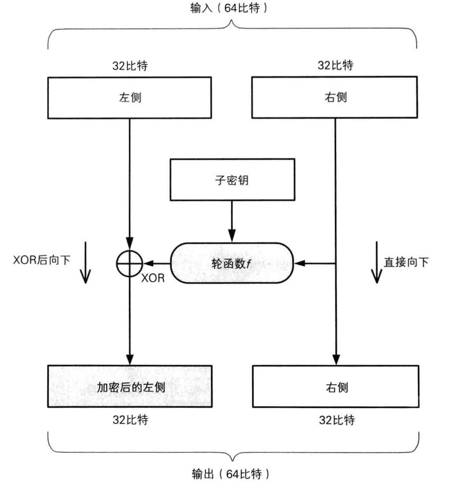

一轮的具体计算步骤如下：

1. 将输入的数据等分为左右两部分。
2. 将输入的右侧直接发送到输出的右侧。
3. 将输入的右侧发送到轮函数。
4. 轮函数根据右侧数据和子密钥，计算出一串看上去是随机的比特序列。
5. 将上一步得到的比特序列与左侧数据进行异或运算，并将结果作为加密后的左侧。

由于经过上述步骤，右侧数据没有被加密，因此需要用不同的子密钥对一轮的处理重复若干次，并在每两轮处理之间将左侧和右侧的数据对调。

Feistel网络的性质：

1. Feistel网络的轮数可以任意增加。
2. 加密时无论使用任何函数作为轮函数都可以正确解密。
3. 加密和解密可以用完全相同的结构来实现。

### 3.6 三重DES

#### 3.6.1 什么是三重DES

**三重DES**是为了增加DES的强度，将DES重复3次所得到的一种密码算法，通常缩写为3DES。

#### 3.6.2 三重DES的加密

三重DES的加密机制如下图所示：

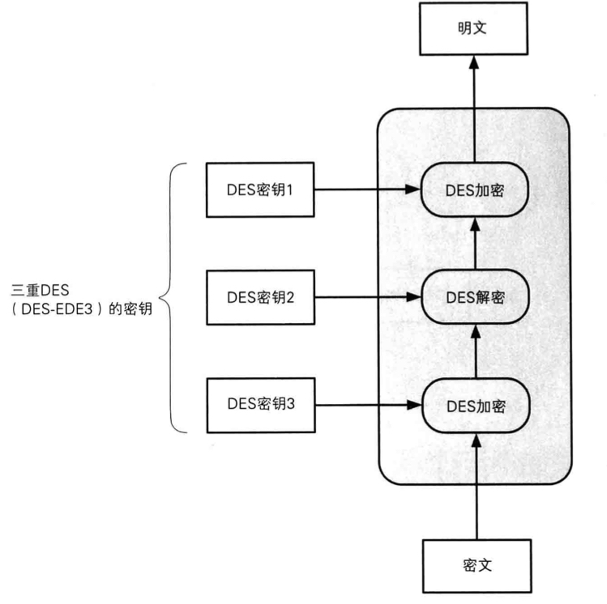

明文经过三次DES处理才能变成最后的密文，由于DES密钥的长度实质上是56比特，因此，三重DES的密钥长度就是56×3=168比特。其密钥空间为2^56 ×2^56 ×2^56= 2^168。  

三重DES是加密→解密→加密的过程，中间加入解密过程是为了让三重DES能够兼容普通的DES。

当三重DES中所有的密钥都相同时，三重DES就等于普通DES。因为在前两步的加密、解密之后得到的就是最初的明文。即三重DES对DES具备向下兼容性。

如果密钥1和密钥3使用相同的密钥，而密钥2使用不同的密钥，这种三重DES就称为DES-EDE2。EDE表示的是加密→解密→加密这个流程。密钥123全部使用不同的比特序列的三重DES称为DES-EDE3。

#### 3.6.3 三重DES的解密

三重DES的解密过程和加密正好相反，是以密钥3、密钥2、密钥1的顺序执行解密→加密→解密的操作。

#### 3.6.4 三重DES的现状

尽管三重DES目前还在被银行等机构使用，但其处理速度不高，而且在安全性方面也逐渐显出一些问题。

### 3.7 AES的选定过程

#### 3.7.1 什么是AES

**AES**是取代其前任标准（DES）而成为新标准的一种对称密码算法。在2000年选中名为Rijndael的对称密码算法，将其确定为AES。

### 3.8 Rijndael

#### 3.8.1 什么是Rijndael

Rijndael是一种分组密码，其分组长度为128比特，密钥长度可以以32比特为单位在128比特到256比特的范围进行选择。

#### 3.8.2 Rijndael的加密和解密

Rijndael使用了**SPN**结构。

加密步骤：

1. 逐字节地对16字节地输入数据进行SubBytes处理：以每个字节的指为索引，从一张拥有256个值的替换表中查找出对应值。即将一个字节的值替换为另一个字节的值。
2. 进行ShifRows处理，即将SubBytes的输出以字节为单位进行打乱处理。
3. 进行MixColumns处理，即对一个4字节的值进行比特运算，将其变为另一个4字节的值。
4. 进行AddRoundKey处理，即将上步输出与轮密钥进行异或。
5. 重复上述步骤10~14轮。

## 第四章 分组密码的模式

### 4.2 分组密码的模式

#### 4.2.1 分组密码与流密码

**分组密码**：每次只能处理特定长度的一块数据的密码算法，其中”一块“就称为分组，一个分组的比特数就称为分组长度。

**流密码**：是对数据流进行连续处理的一类密码算法。流密码中一般以1比特、8比特或32比特等为单位进行加密和解密。一次性密码本属于流密码。

#### 4.2.2 什么是模式

模式就是分组密码的迭代方法。

将明文分割成多个分组并逐个加密的方法称为ECB模式，这种模式具有很大的弱点。

分组密码的模式主要有：

- ECB模式（电子密码本模式）
- CBC模式（密码分组链接模式）
- CFB模式（密码反馈模式）
- OFB模式（输出反馈模式）
- CTR模式（计数器模式）

#### 4.2.3 明文分组与密文分组

**明文分组**是指分组密码中作为加密对象的明文。明文分组的长度与分组密码算法的长度是相等的。

**密文分组**是指使用分组密码算法将明文分组加密之后所生成的密文。

#### 4.2.4 主动攻击者Mallory

主动攻击者可以主动介入发送者和接收者之间的通信过程，进行阻碍通信或者篡改密文等活动。

### 4.3 ECB模式

#### 4.3.1 什么是ECB模式

ECB模式全称是Electronic　CodeBook模式。在ECB模式中，将明文分组加密之后的结果将直接成为密位分组。

使用ECB模式加密时，相同的明文分组会被转换为相同的密文分组。当最后一个明文分组的内容小于分组长度时，需要一些特定的数据进行填充。

#### 4.3.2 ECB模式的特点

明文分组与密文分组一一对应，多个相同的明文分组会被转换为相同的密文分组，可以此为线索来破译密码，因此存在一定的风险。

#### 4.3.3 对ECB模式的攻击

假如存在主动攻击这Mallory，他能够改变密文分组的顺序。当接收者对密文进行解密时，由于密文分组的顺序被改变了，因此相应的明文分组的顺序也会被改变。即，攻击者Mallory*无需破译密码就能够操纵明文*。

### 4.4 CBC模式

#### 4.4.1 什么是CBC模式

CBC模式全称是Cipher Block Chaining模式（**密文分组链接模式**）。在CBC模式中，首先将明文分组与前一个密文分组进行异或运算然后再进行加密。如下图所示：

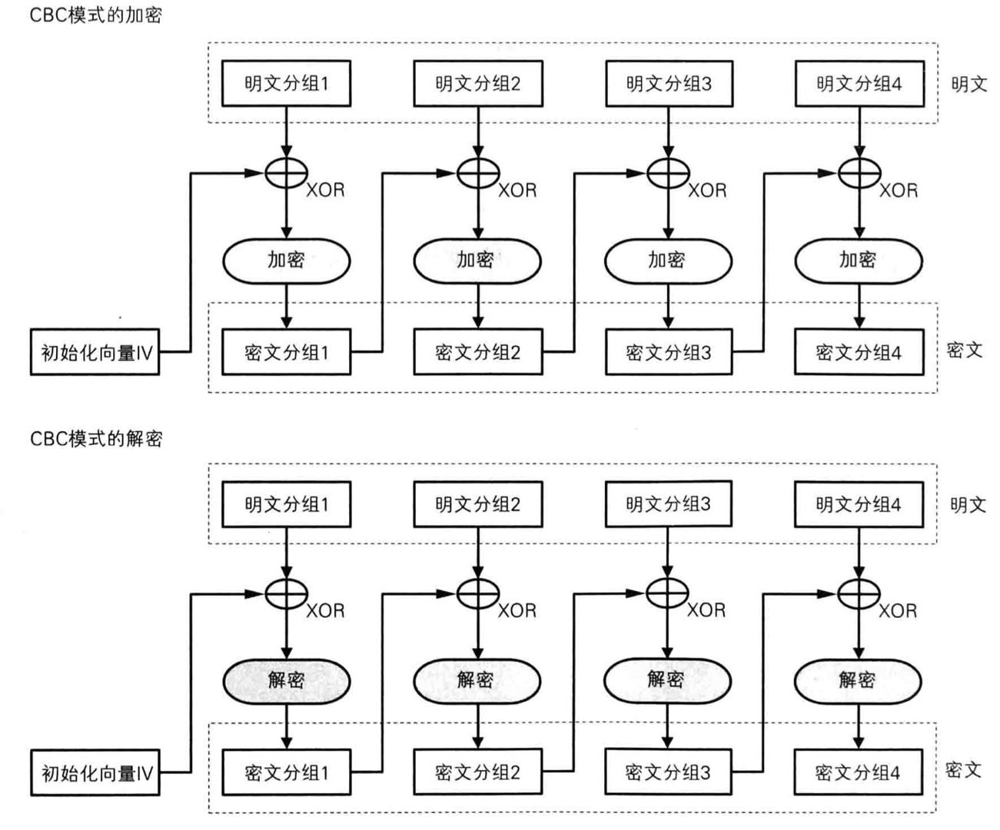

#### 4.4.2 初始化向量

当加密第一个明文分组时，由于不存在前一个密文分组，因此需要事先准备一个长度为一个分组的比特序列来代替前一个密文分组，这个比特序列就称为**初始化向量**。

#### 4.4.3 CBC模式的特点

1. 相同的明文分组经加密后不会成为相同的密文分组。

2. 密文分组中若有一个分组损坏但是密文分组的长度没有改变则解密时最多只会有2个分组受到数据损坏的影响。如下图所示：

   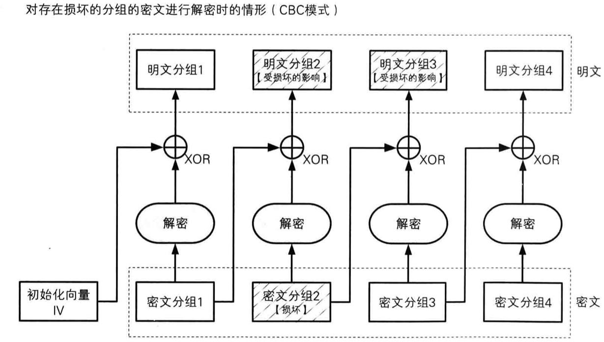

3. 若密文分组中有一些比特缺失，导致密文分组的长度发生变化，则缺失比特的位置后的密文分组将全部无法解密。如下图所示：

   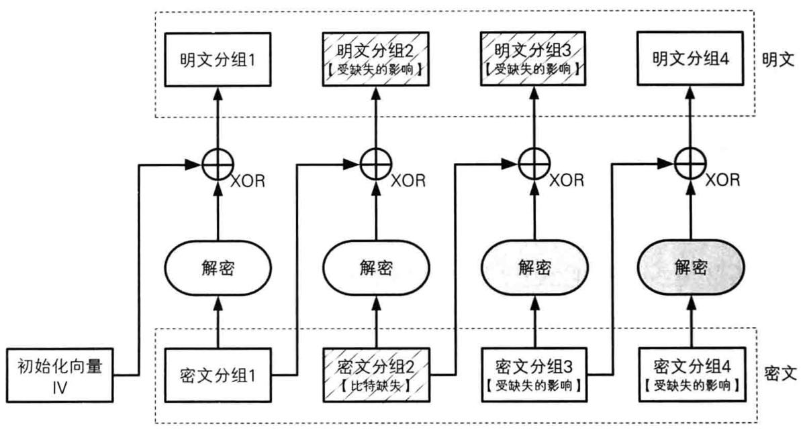

#### 4.4.4 对CBC模式的攻击

Mallory可以通过对初始向量进行攻击，将初始向量中的任意比特进行反转，则明文分组中的相应比特也会进行反转。

如果对密文分组１进行同样的攻击，不仅会使明文分组２中相应的位被反转，由于将密文分组２解密后再与初始化向量异或得到明文分组１，经过解密后，密文分组中１比特的变化可能扩展到多位，因此会对明文分组１中多个比特造成影响。即只让明文分组１中Mallory所期望的特定比特发生变化是很困难的。

#### 4.4.5 CBC的应用实例

确保互联网安全的通信协议之一的IPsec就是使用CBC模式来确保通信机密性的。

### 4.5 CFB模式

#### 4.5.1 什么是CFB模式

CFB模式的全称是CIpher FeedBack模式（**密文反馈模式**）。在CFB模式中，前一个密文分组会被送到密码算法的输入端。所谓反馈即返回输入端的意思。

CFB模式的加解密过程如下图所示：

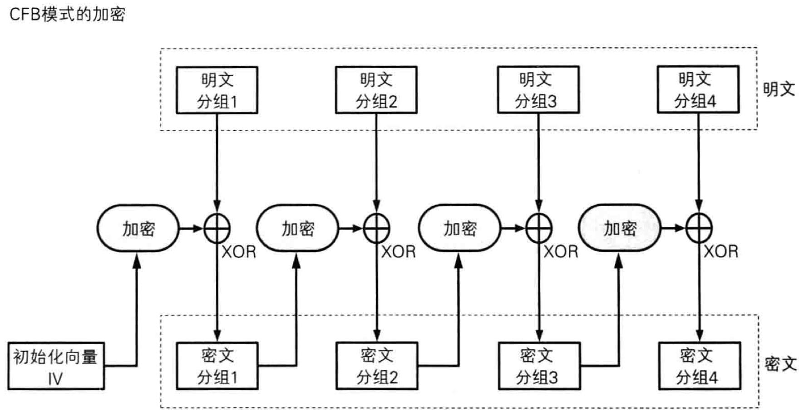

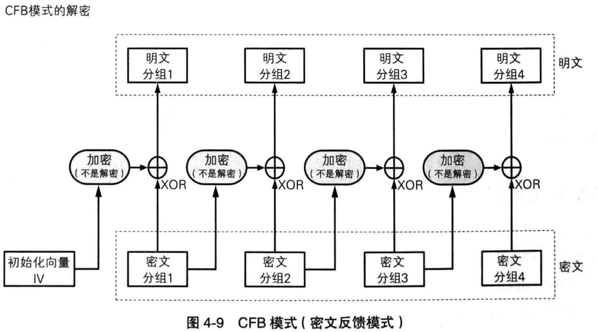

由上图可见，在CFB模式中，明文分组并没有通过密码算法来直接进行加密，明文分组和密文分组之间只有异或操作。

#### 4.5.3 CFB模式与流密码

在通过异或来进行加密这一点上，CFB模式与一次性密码本是非常相似的。在CFB模式中，密码算法的输出相当于一次性密码本中的随机比特序列。由于密码算法本是通过计算得到的，并不是真正的随机数，因此CFB模式不像一次性密码本一样具备理论不可破译性。

CFB模式中由密码算法所生成的比特序列称为**密钥流**。在CFB模式中，密码算法就相当于用来生成密钥流的伪随机数生成器，而初始化向量就相当于伪随机数生成器的“种子“。

在CFB模式中，明文数据可以被逐比特加密，因此可以将CFB模式看作是一种**使用分组密码来实现流密码**的方式。

#### 4.5.5 对CFB模式的攻击

对CFB模式可以实施**重放攻击**。如下图所示：

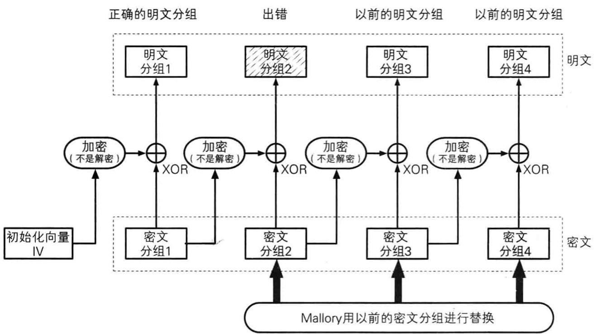

### 4.6 OFB模式

#### 4.6.1 什么是OFB模式

OFB模式的全称是Output-FeedBack模式（输出反馈模式）。在OFB模式中，密码算法的输出会反馈到密码算法的输入中。OFB模式的加解密如下图所示：

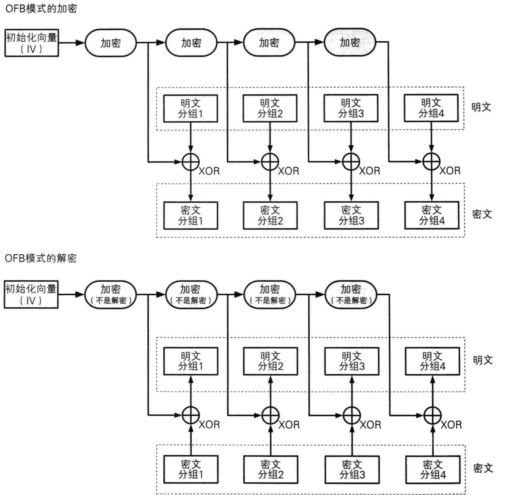

#### 4.6.3 CFB模式与OFB模式的对比

OFB模式与CFB模式的区别仅仅在于密码算法的输入。

CFB模式中，密码算法的输入是前一个密文分组，即将密文反馈到密码算法中。

OFB模式中，密码算法的输入则是密码算法的前一个输出，即将输出反馈到密码算法中。

CFB模式与OFB模式的对比如下图所示：

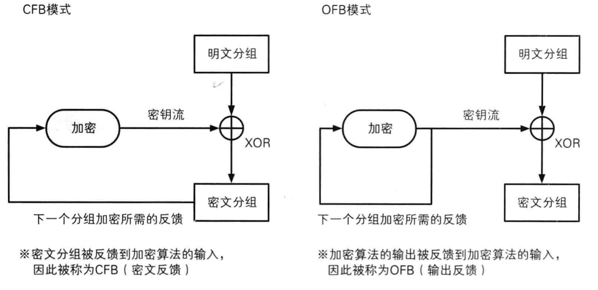

由于在CFB模式中是对密文分组进行反馈的，因此必须从第一个明文分组开始按顺序进行加密，也就是说无法跳过明文1而先对明文2进行加密。而在OFB模式中，异或所需的比特序列（密钥流）可以事先通过密码算法生成，和明文分组无关。只要提前准备好所需的密钥流，则在明文生成密文过程中不再需要使用密码算法，即意味着只要提前准备好密钥流就可以快速完成加密。

### 4.7 CTR模式

CTR模式的全称是Count TeR模式（计数器模式）。CTR模式是一种**通过将逐次累加的计数器进行加密来生成密钥流的流密码**。

CTR模式中，每个分组对应一个逐次累加的计数器，并通过对计数器进行加密来生成密钥流。也就是说，最终的密文分组是通过将计数器加密得到的比特序列，与明文分组进行异或而得到的。

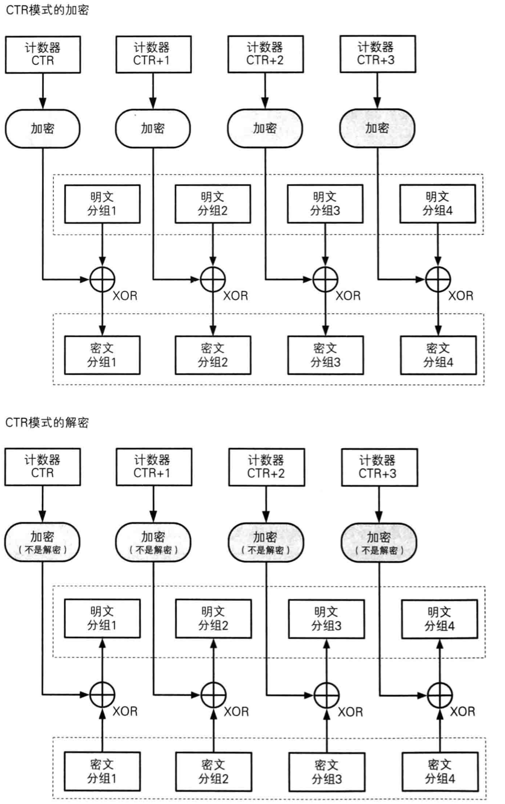

#### 4.7.3 CTR模式的特点

1. CTR模式的加密和解密使用了完全相同的结构，因此在程序上实现比较容易。
2. CTR模式可以以任意顺序进行加密和解密，因为在加密和解密用到的“计数器”的值可以直接计算出。这一点意味着能够实现并行计算。

#### 4.7.4 错误与机密性

在CTR模式中，主动攻击这Mallory可以通过反转密文分组中的某些比特，引起解密后明文中的相应比特也发生反转，这一弱点与OFB模式相同。

在OFB模式中，如果对密钥流的一个分组进行加密后其结果碰巧和加密前是相同的，那么这一分组之后的密钥流就会变成同一值的不断反复，CTR模式就没有这个缺点。

## 第五章 公钥密码

### 5.4 公钥密码

#### 5.4.1 什么是公钥密码

公钥密码中，密钥分为加密密钥和解密密钥两种。发送者用加密密钥对消息进行加密，接收者用解密密钥对密文进行解密。加密密钥被称为**公钥**，解密密钥被称为**私钥**。公钥和私钥一一对应，一对公钥和私钥统称为密钥对。

#### 5.4.3 公钥通信的流程

在公钥密码通信中，通信过程是由接收者Bob来启动的。

1. Bob生成一个包含公钥和私钥的密钥对。私钥由Bob自行妥善保管。
2. Bob将自己的公钥发送给Alice。将公钥发送给Alice表示Bob请Alice用这个公钥对消息进行加密并发送给他。Bob的公钥被窃听者Eve截获也没有关系。
3. Alice用Bob的公钥对消息进行加密。
4. Alice将密文发送给Bob。
5. Bob用自己的私钥对密文进行解密。

#### 5.4.5 公钥密码无法解决的问题

1. **公钥认证问题**：需要判断所得到的公钥是否正确合法。
2. 公钥密码的处理速度只有对称密码的几百分之一。

###  5.6 RSA

#### 5.6.1 什么是RSA

RSA是一种公钥密码算法，可以被用于公钥密码和数字签名。

#### 5.6.2 RSA的加密

RSA的加密过程可以用下列公式表示：

**密文=明文^E mod N**

即，RSA的密文是对代表明文的数字的E次方求mod N的结果。E和N的组合就是公钥，一般写成“公钥是（E，N）

#### 5.6.3 RSA的解密

RSA的解密过程可以用下列公式表示：

**明文=密文^D mod N**

即，对表示密文的数字的D次方求mod N就可以得到明文。其中N和加密时的N相同，D和N的组合就是私钥。

#### 5.6.4 生成密钥对

生成密钥对就是求E、D、N三个数的。

1. 求N：准备两个很大的质数p、q，N=p*q。

2. 求L（L是仅在生成密钥对的过程中使用的数）：L是p-1和q-1的最小公倍数。如果用lcm(X,Y)来表示”X和Y的最小公倍数“，则L可以写成下列形式。L=lcm(p-1,q-1)

3. 求E：E是一个比1大比L小的数，此外，E和L的最大公约数必须是1.如果用gcd(X,Y)来表示X和Y的最大公约数，则E和L之间存在下列关系：1<E<L;gcd(E,L)=1;

4. 求D：数D是由数E计算得到的。E、D和L之间必须具备下列关系：

   1<D<L

   E×D mod L=1

#### 5.7 对RSA的攻击

#### 5.7.1 通过密文来求得明文

RSA的加密过程是：密文=明文^E mod N，通过密文求明文是一个求离散对数的问题，这是非常困难的。

#### 5.7.2 通过暴力破解来找出D

D的长度通常为1024比特以上，要在这样的长度下用暴力破解找出D是极其困难的。

#### 5.7.3 通过E和N求出D

要通过E求出D就需要知道L，要知道L就需要知道p，q。因此质数p，q不能被密码破译者知道。

**对N进行质因数分解攻击**：由N求p，q只能通过将N进行质因数分解来完成，因此一旦发现了对大整数进行质因数分解的高效算法，RSA就能够被破译。但是目前还是很难。

**通过推测p，q进行攻击**：由于p，q是通过伪随机数生成器产生的，如果伪随机数生成器的算法很差，则可能被推测出来。

#### 5.7.4 中间人攻击

中间人攻击就是主动攻击者Mallory混入发送者和接收者中间，对发送者伪装成接收者，对接收者伪装成发送者的攻击方式。

中间人攻击可以针对任何公钥密码。要防御中间人攻击需要使用认证的手段和公钥的**证书**。

### 5.8 其他公钥密码

#### 5.8.1 EIGamal方式

ELGamal方式利用了mod N下求离散对数的困难度，缺点是经过加密后的密文长度会变为明文长度的两倍。

#### 5.8.2 Rabin方式

Rabin方式利用了mod N 下求平方根的困难度。

#### 5.8.3 椭圆曲线密码

椭圆曲线密码是通过将椭圆曲线上的特定点进行特殊的惩罚运算来实现的，利用了这一乘法运算的逆运算非常困难的特性。其特点是所需的密钥长度比RSA短。

## 第六章 混合密码系统

混合密码系统用对称密码来加密明文，用公钥密码来加密对称密码中所使用的密钥。通过使用混合密码系统，就能够在通信中将对称密码和公钥密码的优势结合起来。

## 第七章 单向散列函数

### 7.2 什么是单向散列函数

#### 7.2.2 什么是单向散列函数

**单向散列函数**有一个输入和一个输出，其中输入称为**消息**，输出称为**散列值**。单向散列函数可以根据消息的内容计算出散列值，而散列值就可以被用来检查消息的完整性。单向散列函数是一种采集文件指纹的技术，散列值就相当于消息的指纹。

散列值的长度与消息的长度无关，单向散列函数总会计算出固定长度的散列值。

#### 7.2.3 单向散列函数的性质

- 根据任意长度的消息计算出固定长度的散列值。

- 能够快速计算出散列值。

- 消息不同散列值也不同。两个不同的消息产生同一个散列值的情况称为**碰撞**。难以发现碰撞的性质称为**抗碰撞性**。密码技术中使用的单向散列函数都需要具备抗碰撞性。

  单向散列函数必须确保**要找到和该条消息具有相同散列值的另外一条消息是非常困难的**，这一性质称为**弱碰撞性**。与之相对的有**强碰撞性**，所谓强碰撞性是指**要找到散列值相同的两条不同的消息是非常困难的**。密码技术中使用的单向散列函数，不仅要具备弱抗碰撞性，还必须具备强抗碰撞性。

- 具备单向性。即无法通过散列值反算出消息的性质。

#### 7.2.4 关于术语

**单向散列函数**也称为**消息摘要函数**、**哈希函数**、**杂凑函数**。

输入单向散列函数的**消息**也称为**原像**。

单向散列函数输出的**散列值**也称为**消息摘要**或者**指纹**。

**完整性**也称为**一致性**。

### 7.3 单向散列函数的实际应用

#### 7.3.1 检测软件是否被篡改

可以使用单向散列函数来确认自己下载的软件是否被篡改。

#### 7.3.2 基于口令的加密

单向散列函数也被用于基于口令的加密（Password Based Encryption,PBE）。PBE的原理是将口令和盐（salt，通过伪随机数生成器产生的随机值）混合后计算其散列值，然后将这个散列值用作加密的密钥。通过这样的方法可以防御针对口令的字典攻击。

#### 7.3.3 消息认证码

使用单向散列函数可以构造消息认证码。消息认证码是将“发送者和接收者之间的共享密钥”和“消息”进行混合计算出的散列值。使用消息认证码可以检测并防止通信过程中的错误、篡改以及伪装。

#### 7.3.4 数字签名

#### 7.3.5 伪随机数生成器

#### 7.3.6 一次性口令

### 7.6 对单向散列函数的攻击

#### 7.6.1 暴力破解

针对单向散列函数的暴力破解是指利用文件的冗余性生成具有相同散列值的另一个文件，这是一种试图破解单向散列函数的弱碰撞性的攻击。散列值长度越长的单向散列函数抵御暴力破解的能力也越强。

#### 7.6.2 生日攻击

攻击者事先找到两条散列值相同的消息，其中散列值可以是任意值。这是一种试图破解单向散列函数的强抗碰撞性的攻击。

## 第八章 消息认证码

### 8.2消息认证码

#### 8.2.2 什么是消息认证码

**消息认证码**（message authentication code）是一种确认完整性并进行认证的技术。

消息认证码的输入包括任意长度额消息和一个发送者与接收者之间的共享密钥。它可以输出固定长度的数据，这个数据称为MAC值。

#### 8.2.3 消息认证码的使用步骤

1. 发送者Alice和接收者Bob实现共享密钥。
2. 发送者Alice根据共享密钥和消息计算MAC值。
3. 发送者Alice将消息和MAC值两者发送给接收者Bob。
4. 接收者Bob使用共享密钥根据收到的消息计算出MAC值。
5. 接收者Bob将自己计算的MAC值与从Alice初收到的MAC值进行对比。
6. 如果两个MAC值一致，则接收者Bob就可以判定消息的确来自Alice。

### 8.6 对消息认证码的攻击

#### 8.6.1 重放攻击

主动攻击者通过将事先保存的正确MAC值不断重放来发动攻击。

防御重放攻击的方式：

- **序号**：约定每次都对发送的消息赋予一个递增的编号（序号），并且在计算MAC值时将序号也包含在消息中。
- **时间戳**：约定在发送消息时包含当前的时间，如果收到以前的消息，即便MAC值正确也将其当作错误的消息来处理。这种方法虽然有效，但是发送者和接收者的时钟必须一致，且考虑到通信的延迟，必须在时间的判断上留下缓冲。
- **nonce**：在通信之前，接收者先向发送者发送一个一次性的随机数，这个随机数一般称为nonce。发送者在消息中包含这个nonce并计算MAC值。由于每次通信时nonce的值 都会发生变化，因此无法进行重放攻击。该方法虽然有效，但通信的数据量会有所增加。

#### 8.6.2 密钥推测攻击

和对单向散列函数的攻击一样，对消息认证码也可以进行暴力破解和生日攻击。

## 第九章 数字签名

### 9.3 数字签名

在数字签名技术中存在两种行为，即生成消息签名的行为和验证消息签名的行为。生成消息签名的行为是由消息发送者Alice使用“签名密钥”完成的。验证消息签名的行为是由消息接收者Bob或者第三方验证者Victor使用“验证密钥”完成。使用验证密钥无法生成签名，签名密钥只能由签名的人持有，而验证密钥则是任何需要验证签名的人都可以持有。

#### 9.3.4 公钥密码和数字签名

用私钥加密相当于生成签名，用公钥解密相当于验证签名。

### 9.4 数字签名的方法

#### 9.4.1 直接对消息签名的方法

1. **Alice用自己的私钥对消息进行加密**：用私钥加密得到的密文就是Alice对这条消息的签名。
2. **Alice将消息和签名发送给Bob**
3. **Bob用Alice的公钥对收到的签名进行解密**
4. **Bob将签名解密后得到的消息与Alice直接发送的消息进行对比**

#### 9.4.2 对消息的散列值签名的方法

1. **Alice用单向散列函数计算消息的散列值**
2. **Alice用自己的私钥对散列值进行加密**
3. **Alice将消息和签名发送给Bob**
4. **Bob用Alice的公钥对收到的签名进行解密**
5. **Bob将解密后得到的散列值与Alice直接发送的散列值进行对比**

## 第十章 证书

### 10.2 证书

#### 10.2.1 什么是证书

**公钥证书**记有姓名、组织、邮箱、地址等信息，以及属于此人的公钥，并由认证机构施加数字签名。公钥证书也简称为**证书**。

#### 10.2.2 证书的应用场景

1. Bob生成密钥对
2. Bob在认证机构Trent注册自己的公钥
3. 认证机构Trent用自己的私钥对Bob的公钥施加数字签名并生成证书
4. Alice得到带有认证机构Trent的数字签名的Bob的公钥（证书）
5. Alice使用认证机构的公钥验证数字签名，确认Bob的公钥的合法性
6. Alice用Bob的公钥加密消息并发送给Bob
7. Bob用自己的私钥解密密文得到Alice的消息

## 第十一章 密钥

### 11.2 什么是密钥

#### 11.2.1 密钥就是一个巨大的数字

密钥空间的大小由密钥长度决定，密钥空间越大，进行暴力破解就越困难。

#### 11.2.2 密钥与明文是等价的

对于窃取者而言，窃取到密钥就等于知道了明文。

#### 11.3.4 会话密钥与主密钥

每次在通信中只能使用一次的密钥称为**会话密钥**。

在每次通信中一直被重复使用的密钥称为**主密钥**。

#### 11.3.5 用于加密内容的密钥与用于加密密钥的密钥

对用户直接使用的信息进行加密时使用的密钥称为CEK（Contents Encrypting Key，内容加密密钥）。用于加密密钥的密钥则称为KEK（Key Encrypting Key，密钥加密密钥）。

### 11.4 密钥的管理

#### 11.4.1 生成密钥

- 用随机数生成密钥，需要使用专门为密码学用途而设计的伪随机数生成器。
- 用口令生成密钥：在人类可以记住的口令上面附加一串称为“盐”的随机数，然后将其输入单向散列函数。

#### 11.4.3 更新密钥

在更新密钥时，发送者和接收者使用单向散列函数计算当前密钥的散列值，并将这个散列值用作新的密钥。即，用当前密钥的散列值作为下一个密钥。

好处是即使在通信过程中的某个时间点上，密钥被窃听者获取了，窃听者也无法解密更新密钥这个时间点之前的通信内容。这种防止破译过去的通信内容的机制称为**后向安全**。

### 11.5 Diffie-Hellman密钥交换

#### 11.5.1 什么时Diffie-Hellman密钥交换

Diffie-Hellman密钥交换是一种仅通过交换一些可以公开的信息就可以生成共享的秘密数字的算法。这一秘密数字就被用作对称密码的密钥。该方法也被称为**DIffie-Hellman密钥协商**。

#### 11.5.2 Diffie-Hellman密钥交换的步骤

1. **Alice向Bob发送两个质数P和G**，P是一个非常大的质数，G是一个和P相关的数称为**生成元**。G可以实一个较小的数字，P和G不需要保密。
2. **Alice生成一个随机数A**，A是一个1~P-2之间的整数。这个数不需要告诉Bob，必须保密。
3. **Bob生成一个随机数B**，B是一个1~P-2之间的整数。
4. **Alice将G^A mod P这个数发送给Bob**
5. **Bob将G^B mod P这个数发送给Alice**
6. **Alice用Bob发过来的数计算A次方并求mod P** 该值就是共享密钥
7. **Bob用Alice发过来的数计算B次方并求mod P** 该值就是共享密钥

### 11.6 基于口令的密码

#### 11.6.1 什么是基于口令的密码

基于口令的密码（Password Based Encryption，PBE）是一种根据口令生成密码并用该密钥进行加密的方法。

#### 11.6.2 PBE加密

1. **生成KEK**：首先伪随机数生成器会生成一个被称为盐的随机数，将盐和Alice的口令一起输入单向散列函数，得到的散列值就是用来加密的密钥（KEK）
2. **生成会话密钥并加密**：使用伪随机数生成器生成会话密钥，会话密钥用来加密消息。会话密钥使用KEK进行加密后和盐保存在安全的地方。加密会话密钥后，KEK就会被丢弃。
3. **加密消息**：用会话密钥加密消息

#### 11.6.3 PBE解密

1. **重建KEK**
2. **解密会话密钥**
3. **解密消息**

## 第十二章 随机数

### 12.4 随机数的性质

#### 12.4.1 对随机数的性质进行分类

- 随机性——不存在统计学偏差，是完全杂乱的数列。
- 不可预见性——不能从过去的数列推测出下一个出现的数。
- 不可重现性——除非将数列本身保存下来，否则不能重现相同的数列。

以上三个性质越往下越严格。

### 12.5 伪随机数生成器

通过硬件生成的随机数列是根据传感器手机的热量、声音的变化等事实上无法预测和重现的自然现象信息来生成的。向这样的硬件设备旧称为**随机数生成器**。

可以生成随机数的软件称为**伪随机数生成器**。因为仅靠软件无法生成真随机数。

#### 12.5.1 伪随机数生成器的结构

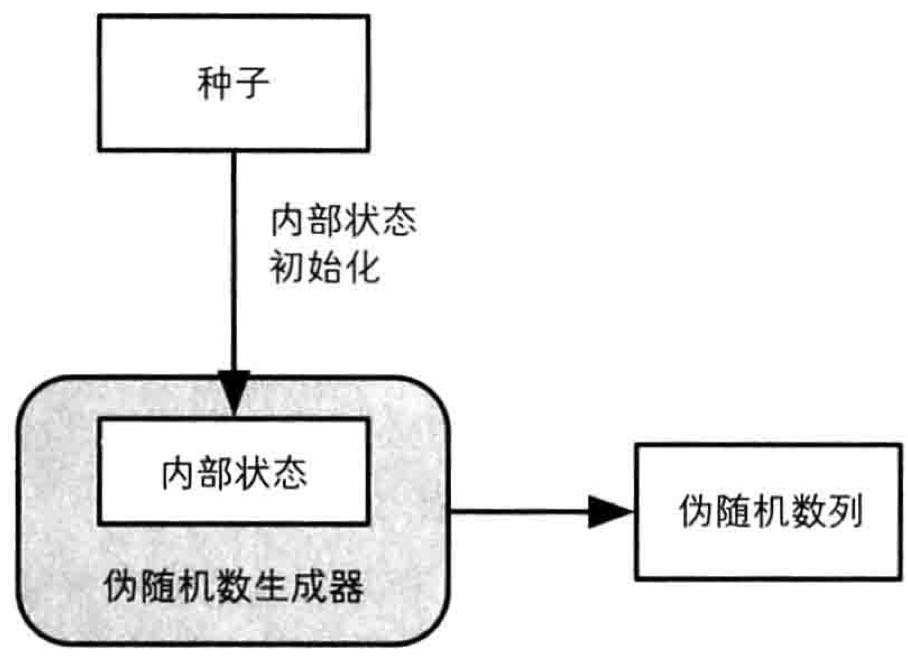

**伪随机数数生成器的内部状态**：指伪随机数生成器所管理的内存中的数值。伪随机数生成器会根据内存中的数值（内部状态）进行计算，并将计算的结果作为伪随机数输出。随后，为了响应下一个伪随机数的请求，伪随机数生成器会改变自己的内部状态。因此将根据内部状态计算伪随机数的方法和改变内部状态的方法组合起来就是伪随机数生成的算法。

**伪随机数生成器的种子**：伪随机数的种子是用来对伪随机数生成器的内部状态进行初始化的。种子需要保密，且不可以使用容易预测的值。

### 12.6 具体的伪随机数生成器

#### 12.6.2 线性同余法

线性同余法是一种使用广泛的伪随机数生成器算法，但是不能用于密码技术。线性同余法计算伪随机数的公式是Rn-1=(A×Rn+C)mod M，简言之就是将当前的伪随机数值乘以A再加上C，然后将除以M得到的余数作为下一个随机数。在线性同余法中，最近一次生成的伪随机数的值就是内部状态，伪随机数的种子被用来对内部状态进行初始化。

线性同余法不具备不可预测性，因此不能用于密码技术中。

#### 12.6.3 单向散列函数

使用单向散列函数可以编写出能够生成具备不可预测性的伪随机数列（即强伪随机数）的伪随机数生成器。

工作方式如下：

1. 用伪随机数的种子初始化内部状态（计数器）。
2. 用单向散列函数计算计数器的散列值。
3. 将散列值作为伪随机数输出；
4. 计数器的值加1。
5. 根据需要的伪随机数数量重复2~4步。

单向散列函数的单向性是支撑伪随机数生成器不可预测性的基础。

#### 12.6.4 密码法

使用密码来编写能够生成强伪随机数的伪随机数生成器。这种伪随机数生成器的工作方式如下：

1. 初始化内部状态（计数器）。
2. 用密钥加密计数器的值。
3. 将密文作为随机数输出。
4. 计数器的值加1。
5. 根据需要的伪随机数数量重复2~4步骤。

密码的机密性是支撑伪随机数生成器不可预测性的基础。

#### 12.6.5 ANSI X9.17

ANSI X9.17伪随机数生成器的工作方式如下：

1. 初始化内部状态。
2. 将当前时间加密生成掩码。
3. 对内部状态与掩码求异或。
4. 将步骤3的结果进行加密。
5. 将步骤4的结果作为伪随机数输出。
6. 对步骤4的结果与掩码求异或。
7. 将步骤6的结果加密。
8. 将步骤7的结果作为新的内部状态。
9. 重复步骤2~8直到得到所需数量的伪随机数。

## 第十三章 PCP——密码技术的完美组合

PGP是于1990年左右由菲利普·季莫曼个人编写的密码软件，现在依然在世界上被广泛使用。

PGP具备现代密码软件所必需的几乎全部功能，如：对称密码、公钥密码、数字签名、单向散列函数、证书、压缩、文本数据（将二进制数据和文本数据相互转换）、大文件的拆分和拼合、钥匙串管理（管理所生成的密钥以及从外部获取的公钥）。

## 第十四章 SSL/TLS——为了更安全的通信

SSL/TLS是将对称密码、公钥密码、单向散列函数、消息认证码、伪随机数生成器、数字签名等技术相结合来实现安全通信的。此外，SSL/TLS还可以通过切换密码套件来使用强度更高的密码算法。

## 第十五章 密码技术与现实社会

