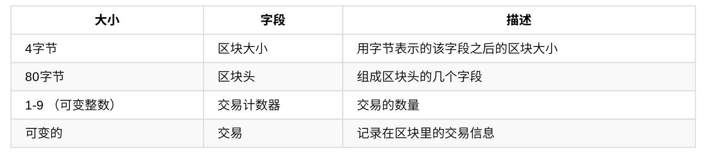
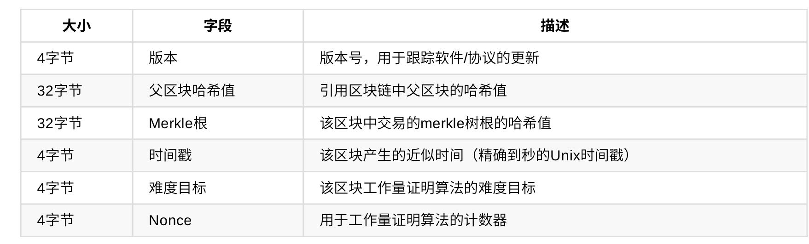

# 精通比特币

### 第一章 介绍

#### 什么是比特币

- 比特币是一个基于数字货币生态系统而形成的概念与技术的集合。
- 比特币是一个点对点网络系统。
- 比特币协议包含了内置算法，该算法可以调节网络中的挖矿功能。

#### 比特币客户端的三种形式

- **完整客户端**：也称为“全节点”，是存储所有比特币交易的整个交易历史的客户端，管理用户的钱包并可以在比特币网络上直接开始交易。
- **轻量级客户端**：存储用户钱包，但不存储包含所有交易的完整副本，因此必须依赖第三方服务器来获取交易确认。
- **在线客户端**：通过网页浏览器在第三方服务器上访问和存储用户的钱包。

### 第二章 比特币的原理

#### 比特币交易

​	交易就是比特币持有者授权把比特币转账给其他人，而新持有者能够再次授权，转移该比特币给所有权链中的其他人。每一笔交易包含一个或多个“输入”，以及一个或多个“输出”。输入和输出的总额不需要相等，当输出累加略少于输入量时，两者的差额就代表了一笔隐含的“矿工费”。交易也包含了每一笔被转移的比特币（输入）的所有权证明，它以所有者的数字签名形式存在，并可以被任何人独立验证。

#### 常见的交易形式

- 一个输入两个输出，其中一个输出为“找零”地址。
- 多个输入一个输出，一般是由钱包应用产生来清理许多在支付过程中收到的小数额的找零。
- 一个输入多个输出，这类交易有时被商业实体用作分配资金，如给员工发工资的情形。

#### 交易的构建

1. **获取正确的输入**：大多数钱包应用维护着一个含有用自己密钥加密的“未消费交易输出”的小型数据库。完整客户端含有整个区块链中所有交易的未消费输出副本。这使得钱包既能使用这些输出构成交易，又能在收到新交易时很快验证其输入是否正确。大多数钱包使用轻量级客户端，只保存用户自己的未消费输出。如果钱包客户端没有某一未交易输出，它可以通过不同的服务者提供的各种API或完整索引节点的JSON PRC API从比特币网络中拿到这一交易信息。
2. **创建交易输出**：交易的输出会被创建成一个包含这笔数额的脚本的形式，只有引入这个脚本的一个解答（即解锁脚本）后才能兑换。
3. **将交易放到总账簿中**：交易被创建后必须被传送到比特币网络中以成为分布式账簿（区块链）的一部分。

#### 比特币挖矿

**挖矿在比特币系统中的作用**：

1. 挖矿在构建新区快时会创造新的比特币。
2. 挖矿创建信任。挖矿确保只有在包含交易的区块上贡献了足够的计算量后，这些交易才被确认。区块越多，花费的计算量越大，意味着更多的信任。

#### 区块中的挖矿交易记录

- 网络中的一笔交易只有成为区块链的一部分以后才被确认为有效。
- 平均每十分钟，矿工会通过自上一个区块创建以后发生的所有交易来生成一个新的区块。
- 新交易不断从用户钱包应用流入比特币网络，当比特币网络钟的节点看到这些交易时，会将他们放到各自节点维护的一个临时的未经验证的交易池中。
- 当矿工构建一个新区块时，会将这些交易从这个交易池中拿出来放到新区快中，然后通过解决一个非常困难的问题（工作量证明）来证明这个新区块的合法性。

### 第四章 密钥、地址、钱包

- 比特币的所有权是通过数字密钥、比特币地址和数字签名来确立的。
- 数字密钥不存储在网络中，而是存储在用户钱包中，完全独立于比特币协议，可由用户钱包软件生成并管理，无需区块链或网络连接。
- 每笔比特币交易都需要一个有效的签名才会被存储在区块链中。
- 比特币使用椭圆曲线乘法作为其公钥加密的基础算法。
- 支付比特币时，比特币的当前所有者需要在交易中提交其公钥和签名（每次交易的签名都不同，但均从一个私钥产生）。比特币网络中所有人都可以通过所提交的公钥和签名进行验证，并确认交易的有效性，即确认支付者在该时刻对所交易的比特币拥有所有权。
- **私钥和公钥**：私钥是一个数字，通常是随机选出来的。有了私钥，就可以使用椭圆曲线乘法产生一个公钥。有了公钥，就可以使用哈希函数生成比特币地址。

#### 比特币钱包

比特币钱包只包含私钥而不包含比特币。比特币是以交易输出的形式存储在比特币中。

**非确定性（随机）钱包**：随机生成的私钥集合。缺点：难以管理、备份及导入。

**确定性（种子）钱包**：通过使用单向离散函数可从公共的种子生成私钥。

**助记码词汇**：用引文单词序列代表确定性钱包中种子所对应的随机数。

**分层确定性钱包**：分层确定性钱包包含从树结构所生成的钥匙，母钥匙可以生成子钥匙，子钥匙可以衍生出孙钥匙。优点：

1. 树状结构可以用来表达额外的组织含义。如当一个特定分支的子密钥被用来接收交易收入并且有另一个分支的子密钥用来负责支付花费。不同分支的密钥都可以被用在企业环境中，这就可以支配不同的分支部门、子公司、具体功能以及会计类别。
2. 允许使用者建立一个公共密钥的序列而不需要访问对应的私钥。可允许HD钱包在不安全的服务器中使用或者在每笔交易中发行不同的公共钥匙。

#### 高级密钥和地址

**加密私钥**：使用一个口令加密私钥并使用Base58Check对加密的私钥进行编码，这样加密的私钥就可以安全地保存在备份介质中，安全地在钱包中传输，保持密钥在任何可能被暴露情况下的安全性。

**P2SH(Pay-to-script Hash)和多重签名地址**：以数字3开头的比特币地址是P2SH地址，其指定比特币交易的受益人为哈希的脚本而不是公钥的所有者。资金被发送到以3开头的地址时，不仅需要一个公钥的哈希值，同时也需要一个私钥签名作为所有者证明。在创建地址时，这些要求会被定义在脚本中，所有对地址的输入都会被这些要求阻隔。<!--P2SH不一定是多重交易，虽然P2SH地址通常代表多重签名，但也可能是其他类型的交易脚本-->P2SH函数最常见的实现是用于多重签名地址脚本，即，底层脚本需要多个签名来证明所有权，此后才能消费资金。

**比特币靓号地址**：靓号地址是包含了可读信息的比特币地址。生成一个靓号地址是一项使用蛮力的过程：尝试一个随机密钥，检查结果地址是否与所需图案相匹配，重复这个过程直到成功找到未知。

**靓号地址的安全性**：靓号地址既可以增加，也可以削弱安全性。用于改善安全性时，一个独特的地质式对手难以使用他们自己的地址替代你的地址。另一方面，靓号地址也可能使得任何人都能创建一个类似于随即地址的地址，甚至另一个靓号地址，从而欺骗你的客户。

**纸钱包**：纸钱包是打印在纸张上的比特币私钥。作为备份机制，一个纸钱包可以提供安全性，以防在电脑硬盘损坏、失窃或意外删除的情况下造成密钥的丢失。作为冷存储机制，如果纸钱包在线下生成并永久不在电脑系统中存储，则在面对黑客攻击、键盘记录、或其他在线电脑欺骗时更有安全性。

### 第五章 交易

#### 比特币交易的生命周期

1. **创建比特币交易**：一笔比特币交易的生命周期起始于它被创建的那一刻，随后，比特币交易会被一个或多个签名加密，这些签名标志着对该交易指向的比特币资金的使用许可。
2. **将比特币交易传送至比特币网络**：
3. **比特币交易在比特币网络中传播**：在比特币网络中，每一个节点（比特币交易参与者）验证、并将交易在网络中进行广播，直到交易被网络中大多数节点接收。最终，比特币交易被一个挖矿节点验证，并被添加到区块链上一个记录着许多比特币交易的区块中。

<!--一笔比特币交易一旦被记录到区块链上并被足够多的后续区块确认，便成为比特币总账簿的一部分，并被所有比特币交易参与者认可为有效交易。于是，被这笔交易分配到一个新所有者名下的比特币资金可以在新的交易中被使用，这使得所有权链得以延申，且再次开启一个新的比特币交易。-->

<!--比特币网络被设计为能高效且灵活地传递交易和区块至所有节点地模式，因而比特币网络能够抵御入侵。为了避免垃圾信息滥发、拒绝服务攻击或其他针对比特币系统地恶意攻击，每一个节点在传播每一笔交易之前均进行独立验证。一个异常交易所能到达的节点不会超过一个。-->

#### 交易结构

一笔比特币交易是一个含有输入值和输出值的数据结构。

**交易的输入和输出**：

- 比特币交易的基本单位是未经使用的一个交易输出，简称UTXO。
- UTXO是不能再分割、被所有者锁住或记录于区块链中并被整个网络识别为货币单位的一定量的比特币货币。
- 比特币网络监测着以百万为单位的所有可用的UTXO，当一个用户接收比特币时，金额被当作UTXO记录到区块链中。
- 比特币钱包通过扫描区块链并聚合所有属于该用户的UTXO来计算该用户的余额。
- 一笔比特币交易可以有任意数值，但必须从用户可用的UTXO中创建。
- 用户钱包通常会从用户可用的UTXO中选取多个可用的个体来拼凑出一个大于或等于一笔交易所需的比特币量。
- 被交易消耗的UTXO被称为交易输入，由交易创建的UTXO被称为交易输出。
- 一笔比特币交易通过使用所有者的签名来解锁UTXO，并通过使用新的所有者的比特币地址来锁定并创建UTXO。
- 交易输出包含两个部分：1、一定量的比特币，“聪”是最小的比特币单位；2、一个锁定脚本，也被当做障碍，提出支付输出所必须被满足的条件以“锁住”这笔总额。
- 交易输入是指向UTXO的指针。若想支付UTXO，一个交易的输入也需要包含一个解锁脚本，用来满足UTXO的支付条件。解锁脚本通常是一个签名，用来证明对于在锁定脚本中的比特币地址拥有所有权。

**交易费**：

- 大多数交易包含交易费，这是为了在网络安全方面给比特币矿工一种补偿。
- 交易费基于交易尺寸，用千字节来计算，而不是基于比特币的价值。
- 交易费会影响处理的优先级，这意味着有足够费用的交易会更可能地被包含在下一个挖出的区块中。
- 交易费不是强制的，且没有交易费的交易最终也会被处理。
- 交易费是输入总和和输出总和的差值。

**交易链和孤立交易**：

- 交易形成一条链，这条链的形式是一笔交易消耗了先前的交易（父交易）的输出，并为随后的交易（子交易）创造了输入。
- 当一个交易链被整个网络传送时，他们并不能总是按照相同的顺序到达目的地。有时子交易在父交易之前到达，在这种情况下，节点首先会收到子交易，而找不到其对应的父交易。因此节点会将其放入一个临时池中，该池被称为**孤立交易池**。

### 第六章 比特币网络

#### P2P网络架构

- P2P是指位于同一网络中的每台计算机都彼此对等，各个节点共同提供网络服务，不存在任何“特殊”节点。每个网络节点以“扁平”的拓扑结构相互联通。
- 比特币网络是按照比特币P2P协议运行的一系列节点的集合。

#### 节点类型及分工

- 每个比特币节点都是路由、区块链数据库、挖矿、钱包服务的功能集合。
- 每个节点都参与全网络的路由功能，同时也包含其他功能。每个节点都参与验证并传播交易区块及区块信息，发现并维持与对等节点的连接。
- **全节点**：包含钱包、矿工、完整区块链、网络路由节点四个完整功能的比特币网络节点。能够独立自主地校验所有交易，而不需要借由任何外部参照。
- **轻量级节点**：只保留了区块链地一部分，通过一种名为“简易支付验证（SPV）”的方式来完成交易验证，因此又称“SPV节点”。
- **挖矿节点**：通过运行在特殊硬件设备上的工作量证明算法，以相互竞争的方式创建新区块

#### 扩展比特币网络

- 运行比特币P2P协议的比特币主网络由大约7000-10000个运行着不同版本的比特币核心客户端的监听节点，以及几百个运行着各类比特币P2P协议的应用的节点组成。
- 扩展比特币网络既包括了运行比特币P2P协议的网络，又包含运行特殊协议的网络节点。

#### 简易支付验证（SPV）节点

- SPV节点只需下载区块头，而不用下载每个区块中的交易信息。
- SPV节点会通过请求Merkel路径证明以及验证区块链中的工作量证明，来证实交易的存在性。
- 完整的区块链节点是通过检查整个链中在它之下的数千个区块来保证这个UTXO没有被支付，从而验证交易。而SPV节点是通过检查在其上面的区块将它压在下面的深度来验证交易。
- SPV节点还在与对等节点的连接上设置了过滤器，用以过滤从对等节点发来的未来区块和交易数据流。
- SPV节点对特定数据的请求可能无意中透漏钱包里的地址信息。使用Bloom过滤器，用以解决SPV节点的隐私泄露问题，允许SPV节点只接收交易信息的子集，同时不会精确泄露哪些是他们感兴趣的地址。

#### Bloom过滤器

- Bloom过滤器是一个允许用户描述特定的关键词组合而不必精确表述的基于概率的过滤方法。
- Bloom过滤器可以让SPV节点指定交易的搜索模式，该搜索模式可以基于准确性或私密性的考虑被调节。

#### 交易池

- 比特币网络中几乎每个节点都会维护一份未确认交易的临时列表，被称为内存池或交易池。节点们利用这个池来追踪那些被网络知晓但还未被区块链所包含的交易。
- 有些节点还维护一个单独的孤立交易池。如果一个交易的输入与某未知交易有关，该孤立交易就会被暂时储存在孤立交易池中直到父交易的信息到达。
- 当一个交易被添加到交易池中，会同时检查孤立交易池，看是否有某个孤立交易引用了此交易的输出。任何匹配的孤立交易会被进行验证。如果验证有效，它们会从孤立交易池中删除，并添加到交易池中，使其以父交易开始的链变得完整。
- UTXO池是区块链中所有未支付交易输出的集合。其不同于交易池的地方在于其初始化时不为空，而是包含了数以百万计的未支付交易输出条目，有些条目的历史甚至可追溯至2009年。UTXO池可能被安置在本地内存，或者作为一个包含索引的数据库表安置在永久性存储设备中。
- 交易池和孤立交易池代表的是单个节点的本地视角。取决于节点的启动时间或重启时间，不同节点的两池内容可能有很大差别。UTXO池代表的是网络的突显共识，因此，不同节点间的UTXO池内容差别不大。**交易池和孤立交易池只包含未确认交易，而UTXO池只包含已确认交易**。

### 第七章 区块链

- 区块链是由包含交易信息的区块从后向前有序连接起来的数据结构。
- 对每个区块头进⾏SHA256加密哈希，可生成⼀个哈希值。通过这个哈希值，可以识别出区块链中的对应区块。同时，每一个区块都可以通过其区块头的“父区块哈希值”字段引用前⼀区块（父区块)。
- ⼀个区块出现多个子区块的情况被称为“区块链分叉”。区块链分叉只是暂时状态， 只有当多个不同区块几乎同时被不同的矿工发现时才会发生。
- 尽管⼀个区块可能会有不⽌⼀个⼦区块，但每⼀区块只有⼀个⽗区块，这 是因为⼀个区块只有⼀个“⽗区块哈希值”字段可以指向它的唯⼀⽗区块。
- 由于区块头⾥⾯包含“⽗区块哈希值”字段，所以当前区块的哈希值因此也受到该字段的影响。如果⽗区块的⾝份标识发⽣变 化，⼦区块的⾝份标识也会跟着变化。当⽗区块有任何改动时，⽗区块的哈希值也发⽣变化。⽗区块的哈希值发⽣改变将迫 使⼦区块的“⽗区块哈希值”字段发⽣改变，从⽽⼜将导致⼦区块的哈希值发⽣改变。
- ⼀旦⼀个区块有很多代以后，这种瀑布 效应将保证该区块不会被改变，除⾮强制重新计算该区块所有后续的区块。正是因为这样的重新计算需要耗费巨⼤的计算 量，所以⼀个⻓区块链的存在可以让区块链的历史不可改变，这也是⽐特币安全性的⼀个关键特征。

#### 区块结构

#### 区块头

#### 区块标识符：区块头哈希值和区块高度

- 区块可以通过两种方式被识别：区块哈希值和区块高度。
- 区块主标识符是它的加密哈希值，一个通过SHA256算法对区块头进行二次哈希运算而得到的数字指纹。产生的32字节的哈希值被称为区块哈希值。**只有区块头被用于计算哈希值**。
- 区块哈希值并不包含在区块的数据结构中，而可能会作为区块元数据的一部分被存储在一个独立的数据库表中，以便于索引和更快地从磁盘检索区块。
- 第一个区块高度为0。一个区块高度并不总是识别一个单一地区块。区块高度也不是区块数据结构的一部分，它并不被存储在区块里。
- 创世区块：区块链中的第一个区块，创建于2009年。

#### Merkel树

- 区块链中的每个区块都包含了产生于该区块的所有交易，且以Merkel树表示。

- Merkel树是一种哈希二叉树，它是一种用作快速归纳和校验大规模数据完整性的数据结构。

- 在比特币网络中，Merkel树被用来归纳一个区块中的所有交易，同时生成整个交易集合的数字指纹，且提供了一种校验区块是否存在某交易的高效途径。

- Merkel树是自底向上构建的，步骤如下：

  1. 将所有交易数据哈希化，然后将哈希值存储至相应的叶子节点。
  2. 串联相邻叶子节点的哈希值，并对其进行哈希操作，生成的哈希值作为这两个叶子节点父节点的哈希值。
  3. 重复上述步骤直到只剩一个节点，即Merkel根。

  <!--因为Merkel树是二叉树，所以需要有偶数个叶子节点。如果仅有奇数个交易西药归纳，那最后的交易就会被复制一份以构成偶数个叶子节点。-->

- 为了证明区块中存在某个特定的交易，一个节点只需要计算log2（N）个32字节的哈希值，形成一条从特定交易到树根的认证路径或者Merkle路径即可。

### 第八章 挖矿与共识

- 矿⼯们验证每笔新的交易并把它们记录在总帐簿上。每10分钟就会有⼀个新的区块被“挖掘”出来，每个区块⾥包含着从上⼀ 个区块产⽣到⽬前这段时间内发⽣的所有交易，这些交易被依次添加到区块链中。我们把包含在区块内且被添加到区块链上 的交易称为“确认”交易。
- 矿⼯们在挖矿过程中会得到两种类型的奖励：创建新区块的新币奖励，以及区块中所含交易的交易费。
- 挖矿保护了⽐特币系统的安全，并且实现了在没有中⼼机构的情况下，也能使整个⽐特币⽹络达成共识。
- 区块中的第⼀笔交易是笔特殊交易，称为创币交易或者coinbase交易。用于奖励矿工所作的贡献。
- 与常规交易不同，创币交易没有输⼊，不消耗UTXO。它只包含⼀个被称作coinbase的输⼊，仅仅⽤来创建新的⽐特币。创 币交易有⼀个输出，⽀付到这个矿⼯的⽐特币地址。
- 每⼀个节点对每⼀个新区块的独⽴校验，确保了矿⼯⽆法欺诈。
- 节点维护三种区块：第⼀种是连接到主链上的，第⼆种是从主链上产⽣分⽀的（备⽤链），最后⼀种是在已知链中没有找到 已知⽗区块的。在验证过程中，⼀旦发现有不符合标准的地⽅，验证就会失败，这样区块会被节点拒绝，所以也不会加⼊到 任何⼀条链中。
- 如果节点收到了⼀个有效的区块，⽽在现有的区块链中却未找到它的⽗区块，那么这个区块被认为是“孤块”。孤块会被保存 在孤块池中，直到它们的⽗区块被节点收到。⼀旦收到了⽗区块并且将其连接到现有区块链上，节点就会将孤块从孤块池中 取出，并且连接到它的⽗区块，让它作为区块链的⼀部分。当两个区块在很短的时间间隔内被挖出来，节点有可能会以相反 的顺序接收到它们，这个时候孤块现象就会出现。
- 区块链分叉后，短链上的节点接纳了新的更长的链，被迫改变了原来对区块链的观点，这叫做链的重新共识。

#### 共识攻击

- ⽐特币的共识机制指的是，被矿⼯（或矿池）试图使⽤⾃⼰的算⼒实⾏欺骗或破坏的难度很⼤。然⽽，当⼀个或者⼀群拥有了整个系统中⼤量算⼒的矿⼯出现之后，他们就可以通过攻击⽐ 特币的共识机制来达到破坏⽐特币⽹络的安全性和可靠性的⽬的。
- 共识攻击能够造成的唯 ⼀影响是影响最近的区块（最多10个）并且通过拒绝服务来影响未来区块的⽣成。
- 双重⽀付可以有两种⽅式：要么是在交易被确认之前， 要么攻击者通过块链分叉来完成。进⾏51%攻击的⼈，可以取消在旧分叉上的交易记录，然后在新分叉上重新⽣成⼀个同样 ⾦额的交易，从⽽实现双重⽀付。
- 共识攻击中除了“双重⽀付”攻击，还有⼀种攻击场景就是拒绝对某个特定的⽐特币地址提供服务。⼀个拥有了系统中绝⼤多 数算⼒的攻击者，可以轻易地忽略某⼀笔特定的交易。如果这笔交易存在于另⼀个矿⼯所产⽣的区块中，该攻击者可以故意 分叉，然后重新产⽣这个区块，并且把想忽略的交易从这个区块中移除。这种攻击造成的结果就是，只要这名攻击者拥有系 统中的绝⼤多数算⼒，那么他就可以持续地⼲预某⼀个或某⼀批特定钱包地址产⽣的所有交易，从⽽达到拒绝为这些地址服 务的⽬的。
- 本质上来看，共识攻击，就像是系统中所有矿⼯的算⼒被分成了两组，⼀组为诚实 算⼒，⼀组为攻击者算⼒，两组⼈都在争先恐后地计算块链上的新块，只是攻击者算⼒算出来的是精⼼构造的、包含或者剔 除了某些交易的块。

